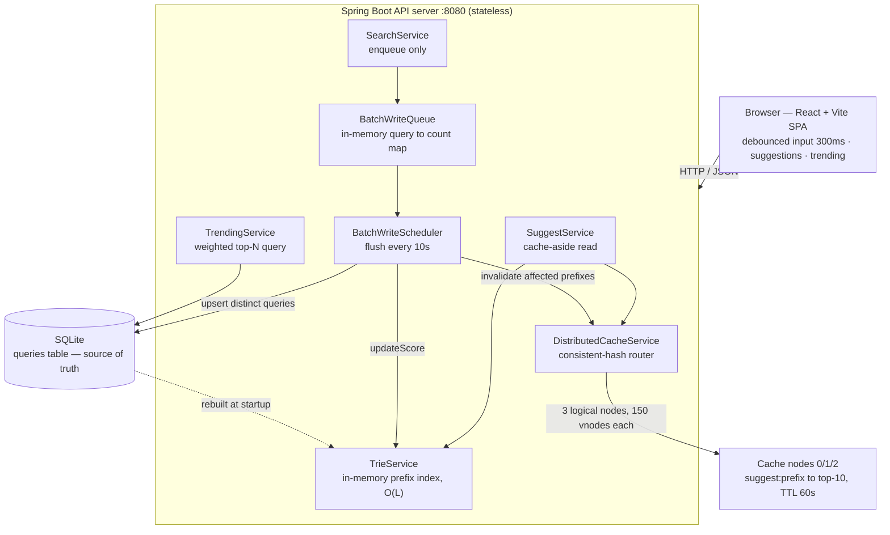
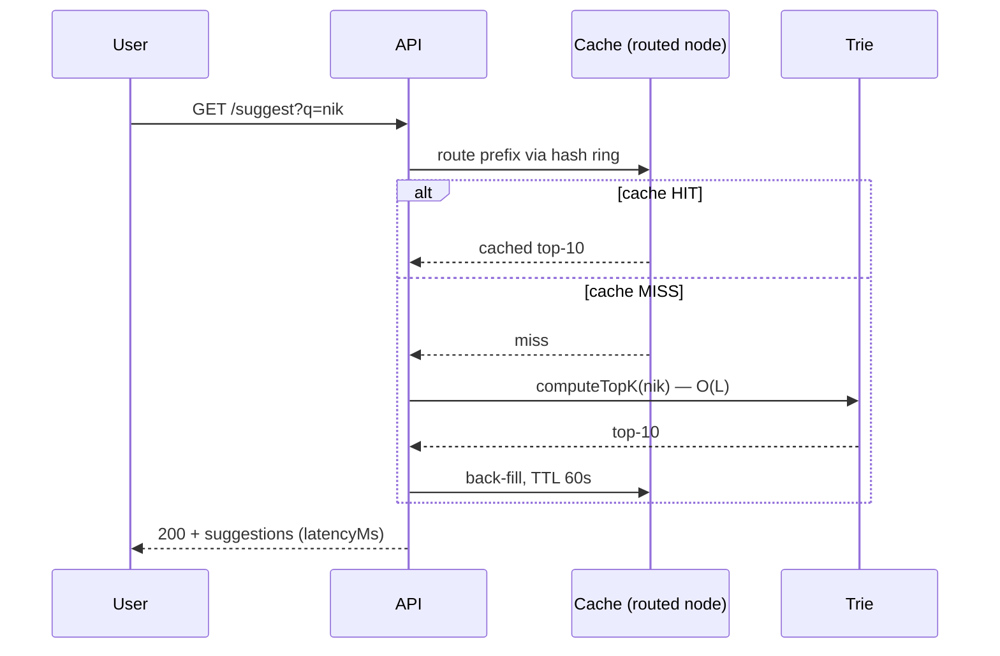
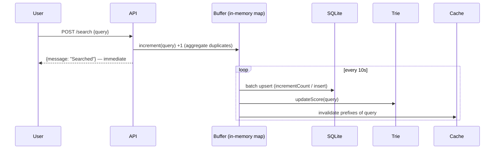

# Search Typeahead System — Project Report

A low-latency autocomplete engine built on an **in-memory trie index**, an **in-process
distributed cache sharded with consistent hashing**, **in-memory write batching**, and a
**recency-aware trending score**. SQLite is the durable source of truth.

**Stack:** Spring Boot 3.2 (Java 17) · SQLite (JPA / Hibernate) · in-process distributed
cache ×3 with consistent hashing · React + Vite · Docker Compose

> **Scope note (honest framing):** the "distributed cache" is **three logical cache nodes
> running inside the backend process**, sharded by a real consistent-hash ring. This
> demonstrates routing, virtual nodes, and even key distribution — *not* network throughput
> or cross-machine failover. Likewise SQLite (not Postgres/Redis) is used as a zero-config
> embedded store appropriate for the assignment demo.

---

## 1. Architecture

The system **decouples the read path from the write path**. Reads are answered from the
in-memory trie fronted by the distributed cache; writes are absorbed into an in-memory
buffer and flushed to SQLite in batches. SQLite stays the durable source of truth and the
trie is rebuilt from it on startup.



*Figure 1 — Read and write paths are decoupled; SQLite is the source of truth.*

### Components

- **Trie (in-memory).** A character-prefix index built from the loaded rows. Walking a prefix
  is **O(L)** in the prefix length, independent of dataset size; a bounded **min-heap** keeps
  the top-10 by score while collecting matches. Updated in place on every batch flush.
- **Distributed cache (in-process ×3).** Three `CacheNode` instances. A `ConsistentHashRouter`
  hashes both nodes and keys onto a 32-bit ring (MD5, first 4 bytes) using **150 virtual nodes
  per physical node**; a key is owned by the first node clockwise. Entries are suggestion lists
  per prefix with a **60 s TTL** plus a 30 s sweeper.
- **Batch buffer.** `BatchWriteQueue` is an in-memory `Map<query, pendingIncrement>` that
  aggregates repeated searches; `BatchWriteScheduler` flushes every 10 s.
- **SQLite (source of truth).** The `queries` table holds durable counts; the trie is rebuilt
  from it on startup, so persistence and read speed coexist.

### Read path — cache-aside with back-fill

On `GET /suggest?q=<prefix>`, the normalized prefix is hashed through the ring to its owning
node. A **hit** returns the cached top-10 immediately. A **miss** computes the top-10 from the
trie, returns it, and back-fills the cache with a TTL. The user always gets an answer — a miss
is just one cheap O(L) compute slower, never empty.



*Figure 2 — Read path.*

### Write path — buffer then batch

`POST /search` never writes to SQLite synchronously. It normalizes the query, pushes a `+1`
into the in-memory buffer, and returns `{ "message": "Searched" }` immediately. A background
scheduler drains the buffer every 10 s: it upserts each **distinct** query, refreshes that
query's trie score, and invalidates the cache entries for each of its prefixes so ranking
changes propagate.



*Figure 3 — Write path. Crash before a flush loses that window — accepted (approximate
analytics counts, not transactional data).*

**Two decoupled clocks.** The 10 s batch-flush clock keeps SQLite fresh; the 60 s cache-TTL
clock bounds suggestion staleness. On a flush the writer also *targets* invalidation of the
affected query's prefixes, so popular changes surface faster than a pure-TTL design.

---

## 2. Dataset — Source & Loading

### Source

The repository ships [`dataset/queries.csv`](dataset/queries.csv) — **224,242 rows** with the
header `query,count` (well above the 100,000-row minimum). It is a generated query-frequency
dataset with a **Zipf-like distribution**: a marquee head (e.g. `the` = 105,577,
`sennheiser` = 98,393) down to a long low-count tail, and **rich prefix clusters** (many
queries sharing head terms) so prefix matching and cache behaviour are meaningfully exercised
rather than flat.

> If you sourced this from a specific public dataset, cite it here; otherwise document it as a
> generated/aggregated query-count set. A small sample (`dataset/sample_queries.csv`) is also
> included for quick runs.

### Storage schema

The JPA entity maps to the `queries` table (SQLite):

| Column             | Type      | Notes                                              |
| ------------------ | --------- | -------------------------------------------------- |
| `id`               | BIGINT PK | Generated via a sequence/table generator (see §4)  |
| `query`            | TEXT      | **Unique**, not null; indexed (`idx_query`)        |
| `historical_count` | BIGINT    | All-time search count                              |
| `recent_count`     | BIGINT    | Recent-window count (drives recency, reset hourly) |
| `last_searched_at` | TIMESTAMP | Last search time                                   |

Prefix matching is the **trie's** job, not the database's — the DB never serves a prefix query.
At startup every row is read once to build the trie.

### Loading instructions

**Docker (recommended):**

```bash
cd docker
docker compose up --build           # backend :8080, frontend :3000
```

On first start the backend reads `/app/dataset/queries.csv` (mounted read-only) and loads it
into SQLite + the trie. The full load of ~224K rows takes several minutes; the app serves from
the portion already loaded and the DB persists in the `typeahead-db-data` volume (subsequent
starts rebuild the trie from the DB rather than re-importing).

**Local (without Docker):**

```bash
# backend/ — local SQLite + dataset paths (committed config uses container paths)
mvn spring-boot:run \
  -Dspring-boot.run.arguments="--spring.datasource.url=jdbc:sqlite:../data/typeahead.db?busy_timeout=60000&journal_mode=WAL&synchronous=NORMAL --app.dataset.path=../dataset/queries.csv"

# frontend/
npm install && npm run dev
```

---

## 3. API Documentation

Interactive OpenAPI 3.0 docs (Swagger UI) are served at **http://localhost:3000/api-docs**
(spec: [`docs/openapi.yaml`](docs/openapi.yaml)). Base URL is `http://localhost:8080` directly,
or `http://localhost:3000/api` through the frontend proxy.

### `GET /suggest?q=<prefix>`
Up to 10 prefix suggestions, ranked by trending score. Cache-aside (trie on miss). Empty/blank
prefix returns an empty list. Suggestions are returned as **strings**.

```json
{
  "suggestions": ["nikon", "nikon tablet", "nikon chair", "nikon backpack"],
  "prefix": "nikon",
  "cacheHit": false,
  "latencyMs": 2,
  "count": 4
}
```

### `POST /search`
Records a search: buffers the increment in memory and returns immediately (ingestion decoupled
from DB latency).

```json
// Request                 // Response (200)
{ "query": "nikon" }       { "message": "Searched" }
// Missing/blank query -> 400
                           { "error": "query is required" }
```

### `GET /trending`
Top-N trending queries by weighted score `0.7*historicalCount + 0.3*recentCount`.

```json
{
  "trending": [
    { "query": "the", "score": 73903.9, "historicalCount": 105577, "recentCount": 0 }
  ]
}
```

> **Basic vs. enhanced ranking** is controlled by config, not a query param: set
> `app.trending.recent-weight=0` for pure all-time-count (basic) ranking, or the default
> `0.3` for recency-aware (enhanced). This is how the two modes are compared.

### `GET /cache/debug?prefix=<prefix>`
Consistent-hash routing for a prefix: which node owns it, whether it is cached, remaining TTL,
the key hash, and that node's hit/miss stats.

```json
{
  "prefix": "nikon",
  "nodeId": "Node-0",
  "hit": true,
  "ttlRemaining": 57,
  "keyHash": 3683164197,
  "nodeHits": 12,
  "nodeMisses": 4,
  "hitRatio": 0.75
}
```

### `GET /cache/stats`
Aggregate per-node cache statistics. Returns **plain text** (not JSON):

```
Node-0: size=120 hits=300 misses=80 ratio=0.79
Node-1: size=98 hits=210 misses=60 ratio=0.78
Node-2: size=110 hits=250 misses=70 ratio=0.78
TOTAL: hits=760 misses=210 ratio=0.78
```

---

## 4. Design Choices & Trade-offs

Every major component was chosen against alternatives — the choice, the reason, and what was
given up.

| Decision | Why chosen | Alternative & trade-off |
| -------- | ---------- | ----------------------- |
| **Spring Boot (Java 17) backend** | Structured DI, JPA for storage, and built-in `@Scheduled` tasks fit the batch-flush and TTL-sweep model cleanly. | Node/Express is lighter for pure I/O; the JVM has warm-up cost. Chosen for structure and built-in scheduling. |
| **In-memory trie prefix index** | Walking a prefix is **O(L)**, independent of dataset size — typing `nik` is the same 3-hop walk at 224K or 10M rows; a min-heap yields top-10 on demand. | Scanning the count map is O(N) per keystroke; precomputing `prefix→top10` explodes memory and is painful to update. The cache stores the computed result instead. |
| **SQLite source of truth** | Zero-config embedded file, durable across restarts, persisted in a Docker volume — "reliable enough for the demo". | Single-writer and not horizontally scalable; Postgres/Redis would scale but need servers. WAL + `busy_timeout` are enabled for concurrent writer/sweeper access. |
| **Sequence/table id generator** (not `IDENTITY`) | The SQLite JDBC driver doesn't support the `getGeneratedKeys` path `IDENTITY` requires; a sequence/table generator also block-allocates ids, keeping the bulk load fast. | `IDENTITY` is simpler but crashes inserts on this driver. |
| **Cache-aside read** | On a miss, compute from the trie, answer the user, back-fill the cache. The user is always answered; a miss is merely slower. | Write-through/precompute would synchronously maintain many prefix keys per write — far more machinery for no gain at this scale. |
| **3 in-process cache nodes + consistent hashing (150 vnodes, MD5 ring)** | Nodes and keys map onto a 32-bit ring; a key walks clockwise to its owner. Removing a node remaps only ~1/N of keys; virtual nodes smooth distribution and avoid hot-spotting. | Naive `hash % N` remaps almost every key when N changes. Honest scope: in-process nodes demonstrate routing/partitioning, not network throughput. |
| **TTL + targeted invalidation** | 60 s TTL bounds staleness; on flush the writer also invalidates the changed query's prefixes so ranking changes surface quickly. | Pure TTL-only can lag truth by a full window; full invalidation-on-write fans out to "which prefixes changed" — the targeted approach is a middle ground. |
| **Weighted recency trending** (`0.7·hist + 0.3·recent`, hourly reset) | Recent searches bump `recent_count`, weighted into the score so live activity rises; an **hourly reset of stale `recent_count`** prevents brief spikes from ranking forever. | Continuous exponential decay is smoother but needs a decay constant and score rebasing; the windowed reset is simpler and tunable via weights. |
| **In-memory batch buffer (10 s flush)** | Repeated searches aggregate in a map (e.g. 50×`nikon` → one `+50` upsert), draining to SQLite in batches — large write-I/O reduction. | **Crash before a flush loses that window** — accepted, since these are approximate popularity counts, not transactional data. A durable log (WAL/Kafka) is the production extension. |
| **300 ms debounce (frontend)** | Standard delay — fast enough to feel instant, slow enough to drop intermediate keystrokes and cut backend calls. | <~150 ms fires too many requests; >~400 ms feels laggy. |

---

## 5. Performance Report

Measured against the running Docker deployment (~224K queries loaded) on a single local host.
Numbers reflect controlled workloads to demonstrate behaviour, and each is reproducible.

**Headline results**

| Metric | Result |
| ------ | ------ |
| p95 suggestion latency (server-side) | **0–1 ms** |
| Cache hit rate (controlled run) | **0.91** |
| Write reduction (300 searches → ~10 writes) | **~97%** |

### Read latency — `GET /suggest`

`/suggest` returns a server-measured `latencyMs`. Over **200** warm requests across 20 prefixes:

| Metric | Value |
| ------ | ----- |
| p50 (server-side) | **0 ms** |
| p95 (server-side) | **1 ms** |
| p99 (server-side) | **1 ms** |
| max (server-side) | 1 ms |
| End-to-end, incl. client/process overhead | ~8 ms |

Even cache misses are fast because the trie answers in O(L); the cache is a further win on top
of an already-cheap compute, not a rescue from a slow one. *Reproduce:* call `/suggest?q=<p>`
repeatedly and read `latencyMs`.

### Cache efficiency

Controlled run — 20 prefixes requested cold once (misses) then repeatedly (hits):

| Metric | Value |
| ------ | ----- |
| Requests | 221 |
| Hits | 201 |
| Misses | 20 |
| **Hit rate** | **0.91** |

Suggestion reads perform **zero database reads** — they are served entirely from cache/trie.
*Reproduce:* compare `TOTAL` in `/cache/stats` before and after a batch of repeated `/suggest`
calls. (The aggregate ratio naturally drops when you probe many *distinct* cold prefixes, e.g.
during the distribution test below — that traffic is intentionally all-misses.)

### Write reduction — batch writes

Controlled run — **300** `POST /search` across **10** distinct queries within the flush window:

```
[Batch] Flushing 10 unique queries to DB
[Batch] Flush complete: 10/10 queries written
```

| Metric | Value |
| ------ | ----- |
| Searches submitted | 300 |
| Distinct queries (aggregated) | 10 |
| DB writes (batched upserts) | ~10 per flush window |
| **Write reduction** | **~97%** (grows with repeat traffic) |

`POST /search` does **0 synchronous DB writes**; persistence happens later in batches.

### Consistent-hash distribution

Routing **400 distinct prefixes** through the ring (150 virtual nodes per physical node) and
tallying the owning node via `/cache/debug`:

| Node | Keys | Share |
| ---- | ---- | ----- |
| Node-0 | 129 | 32.2% |
| Node-1 | 104 | 26.0% |
| Node-2 | 167 | 41.8% |

The split is approximately balanced with the expected sampling variance at 400 keys; more keys
and/or more virtual nodes tighten it further. The point demonstrated is **deterministic
clockwise routing with no hot single bucket**, and that removing a node would remap only its
arcs (~1/N) rather than the whole keyspace.

### DB read/write summary

| Operation | DB reads | DB writes |
| --------- | -------- | --------- |
| `GET /suggest` | 0 (cache + trie) | 0 |
| `POST /search` | 0 (enqueue only) | 0 synchronous (batched later) |
| Batch flush | 1 per distinct query | 1 per distinct query / window |
| `GET /trending` | 1 (top-N query) | 0 |

### Observations

- **Cache** shields the database from read traffic entirely; once a prefix's top-10 is cached,
  reads skip the trie compute.
- **Batching** collapsed 300 search events into ~10 upserts (~97% fewer writes) while keeping
  counts accurate, at the cost of losing an un-flushed window on crash.
- **Trie** keeps even cache-miss latency at ~1 ms, independent of the 224K-row dataset.
